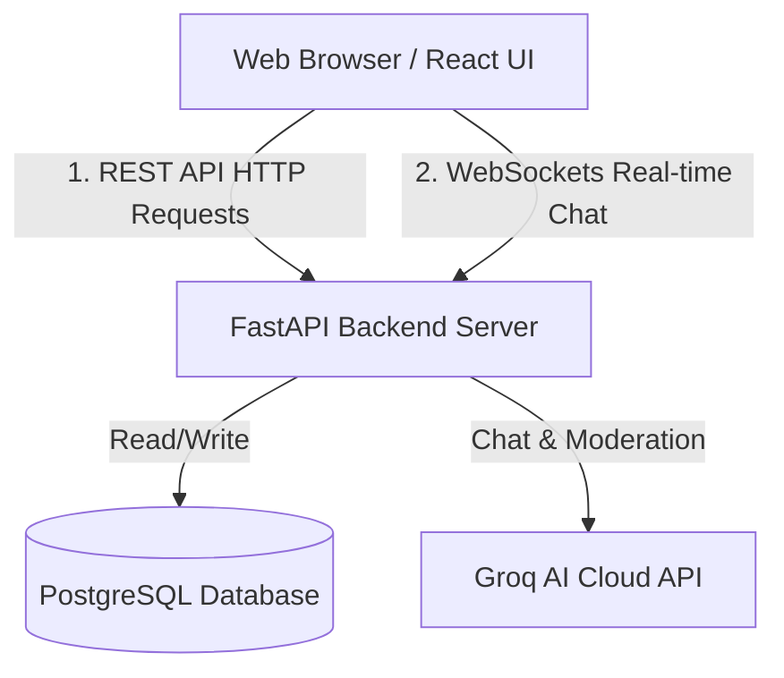
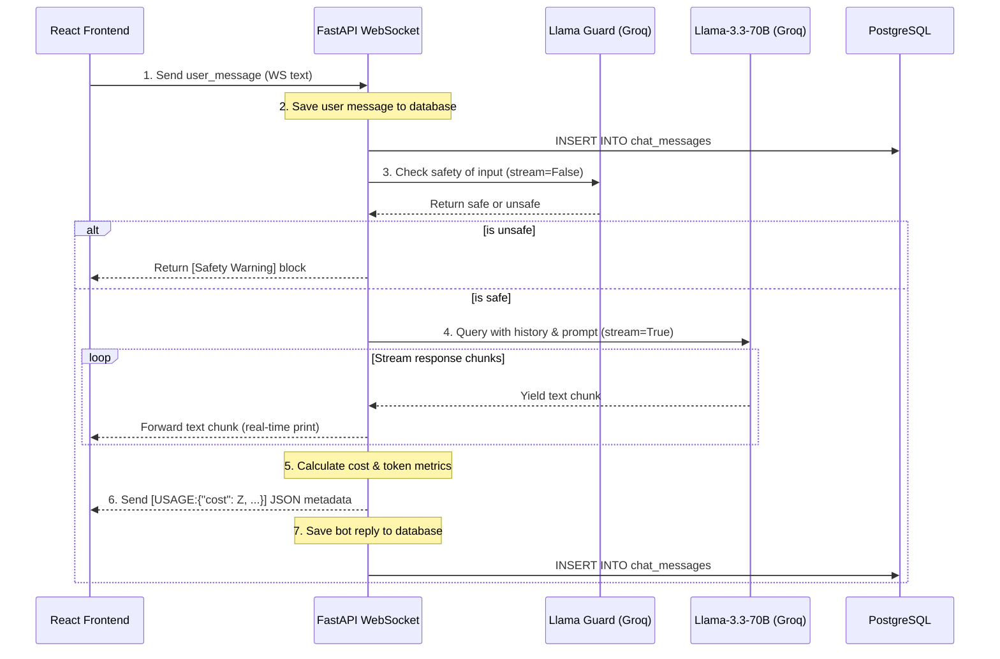

# Zylo English Learning AI — Architecture & Flow Guide

This document explains the entire design, folder structure, and connection flows of the Zylo project, showing how the frontend, backend, database, and LLM APIs work together.

---

## 1. High-Level Architecture

Zylo is a unified single-server application containing:
1.  **Frontend (React SPA)**: Located in `frontend-src/`. Built using **Vite**, **Tailwind CSS**, and **Framer Motion** (for smooth sliding animations). It compiles into static HTML/JS/CSS assets inside `frontend/dist/`.
2.  **Backend (FastAPI)**: Located in `app/`. It serves the compiled React frontend statically, provides REST API endpoints, hosts secure WebSockets, and integrates with the Groq Cloud API.
3.  **Database (PostgreSQL)**: Connected via **SQLAlchemy ORM** to persist chat histories, users, and session details.



---

## 2. Key Directory Structure

```text
zylo-fast-api/
├── app/                        # FastAPI Backend Code
│   ├── auth/                   # Authentication Router & OAuth Flows
│   │   ├── google.py           # Google Sign-in Login + Callback
│   │   └── router.py           # Standard login, signup, token validation
│   ├── chat/                   # Core Chat Mechanics
│   │   ├── model.py            # SQL Tables (ChatSession, ChatMessage)
│   │   ├── prompts.py          # LLM System Prompts & RAG Injection Layer
│   │   ├── router.py           # WebSocket chat router (/ws/chat)
│   │   └── service.py          # Groq integration, Moderation, & Retry logic
│   ├── core/                   # Shared Configuration
│   │   ├── database.py         # SQLAlchemy connection engine
│   │   ├── deps.py             # User dependency injection guards
│   │   └── security.py         # JWT Token creation and verification
│   └── main.py                 # Application entry point (Mounts SPA + Routers)
├── frontend-src/               # React Frontend Source Code
│   ├── src/
│   │   ├── components/         # Reusable UI Blocks (Sidebar, MessageList, TopBar)
│   │   ├── contexts/           # Theme Context (Persisted mode switcher)
│   │   ├── lib/                # api.js shared API fetching utilities
│   │   ├── pages/              # Routing pages (LandingPage, AuthPage, ChatPage)
│   │   └── App.jsx             # React router configuration and Private Guards
│   ├── tailwind.config.js      # Palette mapping (Sky Blue, Sunshine Yellow)
│   └── vite.config.js          # Vite config (Proxies /api calls during dev)
└── frontend/                   # Target Folder for compiled React builds
    └── dist/                   # Static files served directly by FastAPI
```

---

## 3. How Everything is Connected (Flows)

### Flow A: The Authentication Loop (Google OAuth 2.0)
1.  **Frontend Init**: The user clicks "Continue with Google" on the login page.
2.  **API Call**: The browser redirects to `/auth/google/login`.
3.  **Google Handshake**: FastAPI redirects the user to Google's OAuth 2.0 consent screen, passing your Client ID and registered Redirect URI.
4.  **Callback Exchange**: Google validates the request, authenticates the user, and redirects the user back to the backend callback: `http://localhost:8000/auth/google/callback?code=...`.
5.  **Token Exchange & DB Sync**:
    *   The backend exchanges the auth `code` for Google credentials.
    *   It calls Google's tokeninfo endpoint to verify user identity (name, email, unique ID).
    *   It checks the PostgreSQL database. If it's a new email, it registers a new passwordless user (where `hashed_password` is left as `None`).
6.  **Zylo JWT Issuance**: The backend signs a custom JWT access token representing the user's local ID and redirects the browser back to: `/chat?token=YOUR_JWT&username=USERNAME`.
7.  **Client-Side Guard**: The React router `PrivateRoute` checks for the token in the URL query string, mounts the `ChatPage`, extracts the token, saves it to the browser's `localStorage`, and runs `window.location.replace('/chat')` to clean the URL.

---

### Flow B: Starting a Chat & The Real-Time Chat Pipeline
When you send a message, the transaction is handled over a **WebSocket** connection instead of HTTP to allow real-time word-by-word streaming:



1.  **WebSocket Connection Open**: Upon mounting the `ChatPage`, the React hook establishes a WebSocket connection to `ws://localhost:8000/ws/chat?token=YOUR_JWT`.
2.  **Authentication Guard**: The backend receives the query parameter token, extracts the user ID, and authenticates the connection before accepting it.
3.  **Sending Message**: The user types a message and hits enter. The client sends the string over the WebSocket.
4.  **Database Commit (User)**: The backend inserts the user's message into the `chat_messages` table and commits the SQL transaction.
5.  **Moderation Check**: The backend queries Groq's safety model (`llama-guard-3-8b`) with the user's input at `temperature=0.0`. If flagged as `unsafe`, the loop halts and returns a safety warning.
6.  **Streaming & Retry Handshake**:
    *   The backend calls the main tutor model (`llama-3.3-70b-versatile`) with `stream=True`.
    *   This API call is guarded by an async retry-with-backoff loop (`call_with_retry`). If the API experiences a rate limit (429) or timeout, it retries with exponential backoff and jitter.
7.  **Streaming to UI**: As chunks arrive from Groq, they are forwarded straight over the WebSocket. The React component appends them to the last message bubble in state, producing the typing effect.
8.  **Logging Costs**: At the end of the stream, the backend estimates prompt/completion tokens based on characters, calculates the cost, and sends a special payload: `[USAGE:{"prompt_tokens": A, "completion_tokens": B, "cost": C}]`.
9.  **Database Commit (Bot)**: The final bot response is saved to the database. The client intercepts the `[USAGE:` string, saves the data to the React message state, and shows the **Show Usage & Cost** button inside the message bubble.

---

## 4. Key Configurations & Styling (Theme Caching)

*   **Colors**: Custom values are defined in [index.css](file:///d:/zylo/New%20folder/frontend-src/src/index.css) under variables like `--canvas`, `--text-1`, and `--border`. 
*   **Tailwind Override**: Configured in [tailwind.config.js](file:///d:/zylo/New%20folder/frontend-src/tailwind.config.js) to redefine `indigo` and `violet` maps to Sky Blue (`#3498DB`) and Sunshine Yellow (`#F1C40F`).
*   **Theme Caching**: Handled inside [ThemeContext.jsx](file:///d:/zylo/New%20folder/frontend-src/src/contexts/ThemeContext.jsx) using `localStorage`. When the user switches themes, it updates `data-theme` on the `html` root node, instantly swapping the active CSS color tokens.
